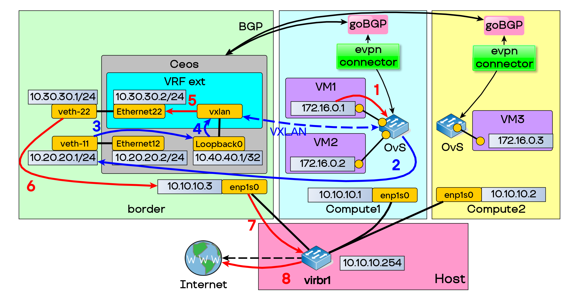

Configuring border for demo env:

Full network scheme 

1. Download Debian 12 nocloud image:
    ```bash
    wget https://cdimage.debian.org/images/cloud/bookworm/latest/debian-12-nocloud-amd64.qcow2
    ```
2. Run virtual machine via virt-manager or qemu:
    ```
    Hostname: border, ip_address: 10.10.10.3 on enp1s0
    ```
3. Install packages:
    ```bash
    sudo apt update
    sudo apt install screen tcpdump jq git wget
    ```

4. Install docker on border router
    ```bash
    sudo apt install ca-certificates curl
    sudo install -m 0755 -d /etc/apt/keyrings
    sudo curl -fsSL https://download.docker.com/linux/debian/gpg -o /etc/apt/keyrings/docker.asc
    sudo chmod a+r /etc/apt/keyrings/docker.asc
    echo \
        "deb [arch=$(dpkg --print-architecture) signed-by=/etc/apt/keyrings/docker.asc] https://download.docker.com/linux/debian \
        $(. /etc/os-release && echo "$VERSION_CODENAME") stable" | \
        sudo tee /etc/apt/sources.list.d/docker.list > /dev/null
    sudo apt update
    sudo apt install docker-ce docker-ce-cli containerd.io docker-buildx-plugin docker-compose-plugin
    ```
5. Download CEOS image (cEOS64-lab-4.34.3M.tar) from [Arista oficial repo](https://www.arista.com/en/support/software-download)

6. Import image to docker
    ```bash
    docker import cEOS64-lab-4.34.3M.tar ceos:4.34.3M
    ```
7. Run CEOS container
    ```bash
    docker run --name ceos --network bridge --privileged -p 4443:443 -td --rm -e INTFTYPE=eth -e ETBA=1 -e SKIP_ZEROTOUCH_BARRIER_IN_SYSDBINIT=1 -e CEOS=1 -e EOS_PLATFORM=ceoslab -e container=docker -e MAPETH0=1 -e MGMT_INTF=enp1s0 ceos:4.34.3M /sbin/init systemd.setenv=INTFTYPE=eth systemd.setenv=ETBA=1 systemd.setenv=SKIP_ZEROTOUCH_BARRIER_IN_SYSDBINIT=1 systemd.setenv=CEOS=1 systemd.setenv=EOS_PLATFORM=ceoslab systemd.setenv=container=docker systemd.setenv=MAPETH0=1 systemd.setenv=MGMT_INTF=enp1s0
    ```
8. Add veth pairs to CEOS container netns
    ```bash
    sudo ip netns attach ceos "$(docker inspect -f '{{.State.Pid}}' ceos)"
    ip link add veth-11 type veth peer name eth12
    ip link set netns ceos eth12
    ip link set veth-11 up
    ip netns exec ceos ip link set eth12 up
    ip link add veth22 type veth peer name eth22
    ip link set veth22 up
    ip link set netns ceos eth22
    ip netns exec ceos ip link set eth22 up
    ```
9. Configure routing in main netns
    ```bash
    ip address add 10.20.20.1/24 dev veth-11
    ip address add 10.30.30.1/24 dev veth22
    ip route add 10.40.40.0/24 via 10.20.20.2
    ip route add 172.16.0.0/24 via 10.30.30.2
    iptables -t nat -A POSTROUTING -s 172.16.0.0/24 -o enp1s0 -j MASQUERADE
    iptables -t nat -A POSTROUTING -s 10.30.30.0/24 -o enp1s0 -j MASQUERADE
    echo 1 > /proc/sys/net/ipv4/ip_forward
    iptables -P FORWARD ACCEPT
    ```
10. Connecting to CEOS CLI
    ```bash
    docker exec -it ceos Cli
    ```
11. Configuring CEOS router
    ```bash
    > no aaa root
    > enable
    # agent Fru terminate
    # agent Ebra terminate
    # configure
    (config)# <paste ./border/ceos_config.txt here>
    (config)# exit
    # write mem
    ```
